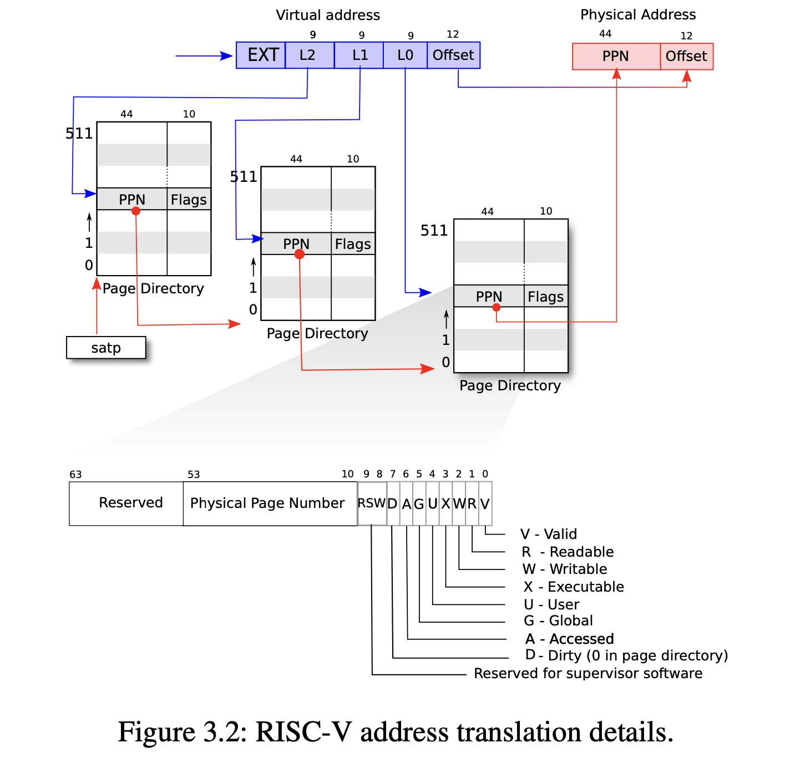

# Lab 4: Page Tables (Expert Depth)

## 0. RISC-V Sv39 & PTE Flags
xv6 RISC-V gebruikt de **Sv39** standaard voor virtual memory.

### Adres Structuur
- **39 bits** worden gebruikt van een virtueel adres.
- **27 bits** voor het Virtual Page Number (VPN), **12 bits** voor de offset (4096 bytes per page).
- De VPN is opgedeeld in 3 niveaus van elk **9 bits** (3 niveaus * 9 bits = 27 bits).



### Page Table Entry (PTE) Flags
De onderste 10 bits van een PTE bevatten de flags:
- **V (Valid):** Indien 0, doet de CPU alsof de PTE niet bestaat (veroorzaakt een page fault).
- **R (Readable):** Mag gelezen worden.
- **W (Writable):** Mag naar geschreven worden.
- **X (Executable):** Bevat uitvoerbare code.
- **U (User):** Indien 1, mag user mode aan deze entry. Indien 0, enkel de kernel.
- **G (Global):** Mapping is geldig in alle virtual address spaces (voorkomt TLB flush bij context switch).
- **A (Accessed):** Hardware zet dit op 1 als de page gelezen/geschreven wordt.
- **D (Dirty):** Hardware zet dit op 1 als er naar de page geschreven wordt.

**Note:** Als `R`, `W` en `X` allemaal 0 zijn en `V=1`, dan is de PTE een pointer naar de volgende page table in de boomstructuur.

## 1. `vmprintmappings` (Walking the Tree)
Recursive function to print all leaf nodes in a page table.
**Implementation in `kernel/vm.c`:**
```c
static void print_pagetable(pagetable_t pagetable, uint64 base_va, int level)
{
  for (uint64 pte_i = 0; pte_i < 512; ++pte_i) {
    pte_t* pte = &pagetable[pte_i];
    uint64 pte_va = base_va | (pte_i << PXSHIFT(level));
    uint64 pte_pa = PTE2PA(*pte);
    uint pte_flags = PTE_FLAGS(*pte);

    if (pte_flags & PTE_V) {
      if (level == 0) {
        char mode = (pte_flags & PTE_U) ? 'U' : 'S';
        char r    = (pte_flags & PTE_R) ? 'r' : '-';
        char w    = (pte_flags & PTE_W) ? 'w' : '-';
        char x    = (pte_flags & PTE_X) ? 'x' : '-';
        printf("%p -> %p, mode=%c, perms=%c%c%c\n", (void *)pte_va, (void *)pte_pa, mode, r, w, x);
      } else {
        pagetable_t next_pagetable = (pagetable_t)pte_pa;
        print_pagetable(next_pagetable, pte_va, level - 1);
      }
    }
  }
}
```

## 2. vDSO Implementation
Mapping a shared read-only page to speed up system calls like `uptime`. Zie het stappenplan [vDSO Toevoegen](adding-vdso.md) voor de volledige walkthrough.

### Kernpunten:
- **Linker Script:** De `.vdso` sectie moet pagina-gelijnd zijn en exact één pagina groot.
- **Mapping:** Gebeurt in `proc_pagetable()` met `PTE_R | PTE_U` (geen `PTE_W`!).
- **User Space:** Data kan direct via een pointer op het bekende virtuele adres worden gelezen.

## 3. Basic `mmap`
Implement anonymous private memory mapping.
**`sys_mmap` logic:**
```c
uint64 sys_mmap(void) {
  uint64 vaddr;
  int perms;
  argaddr(0, &vaddr);
  argint(1, &perms);

  struct proc *p = myproc();
  if(vaddr >= MAXVA || vaddr % PGSIZE != 0) return -1;
  
  // Check if already mapped
  if(walkaddr(p->pagetable, vaddr) != 0) return -1;

  char *mem = kalloc();
  if(mem == 0) return -1;
  memset(mem, 0, PGSIZE);

  if(mappages(p->pagetable, vaddr, PGSIZE, (uint64)mem, perms | PTE_U) != 0){
    kfree(mem); return -1;
  }
  // Store mmapped address in p->mmapped array for cleanup
  p->mmapped[p->mmapcount++] = vaddr;
  return 0;
}
```
**Important:** Don't forget `uvmunmap` in `freeproc` and copying mappings in `fork`.
